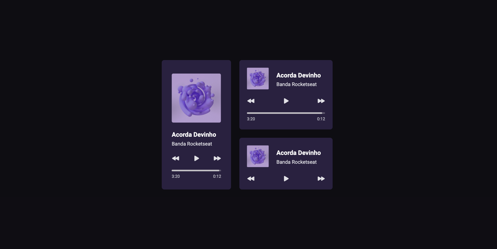

# Desafio #01 - Um player de música

Primeiro de desafio do #boraCodar da Rocketseat. A ideia é codar um pequeno desafio para colocar em prática conhecimentos básico de CSS, HTML e JS.

[Link para o desafio.](https://www.rocketseat.com.br/boracodar/desafios-anteriores/um-player-de-musica-desafio-01)

# Meu resultado:

